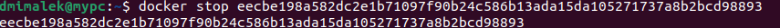

# Simple Docker

Введение в докер. Разработка простого докер образа для собственного сервера.

## Часть 1

- Скачиваем образ nginx

- Проверяем наличие образа

- Запускаем nginx

- Проверяем что nginx запущен

- Инспектируем докер контейнер. Айпи: 172.17.0.2, Порты: ExposedPorts: 80/tcp: {}, размер: 67108864

 \
 \

- Останавливаем контейнер

- Проверяем что контейнер остановился

- Запускаем докер с маппингом

- Контейнер работает

- Перезапускаем контейнер

- Контейнер перезапустился

## Часть 2. Читаем конфиг

- Читаем конфиг nginx

- Создаем файл nginx конфига

- Конфиг чтобы отдавать статус

- Копируем конфиг в контейнер

- Перезапускаем nginx контейнер

- Страничка отдается

- Экспортируем контейнер

- Останавливаем контейнер

- Удаляем образ

- Удаляем остановленный контейнер

- Импортируем контейнер

- Запускаемем контейнер

- Всё работает

